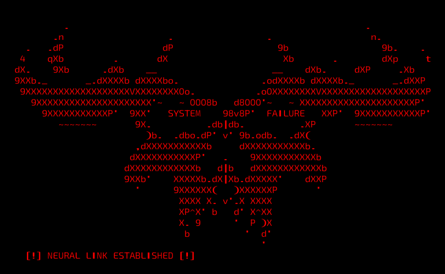

  
  
  <h3>🛡️ Autonomous Adversary Emulation & Cognitive Architecture</h3>

  

    
    
    
  

   

  

   
   

  

    
  

---

  <h2>📜 A Forja: Quem é Ghost Cruz?</h2>

Não sou um desenvolvedor de software tradicional. Meu trabalho não é criar aplicações comerciais, mas sim **arquitetar ecossistemas de resiliência para infraestruturas críticas**. Atuando na intersecção entre a segurança ofensiva e a inteligência artificial, meu laboratório projeta motores cognitivos capazes de pensar, adaptar-se e auditar ambientes corporativos complexos antes que adversários reais o façam. 

Acredito que a segurança de vitrine falhou. Para proteger o mundo real, precisamos emular as piores condições do mundo real.

### 🏴‍☠️ Manifesto Operacional: A Doutrina Power Hat
> "Liberdade operacional não é permissão, é obrigação. A Doutrina Power Hat ignora regras superficiais, revela o invisível e transforma inteligência em ação. Quem se prepara para o mundo real não teme risco: controla o risco antes que ele se torne ameaça."
> 
> — **Ghost Cruz**

---

  <h2>⚙️ O Arsenal: Projetos e Arquiteturas</h2>

### 1. GHOST Protocol (Em Desenvolvimento Ativo)
**[ Cognitive C2 Framework & Enterprise Resilience Validation ]**
O desenvolvimento central do meu laboratório. O GHOST não é um scanner de vulnerabilidades comum, mas uma infraestrutura autônoma de emulação de adversários (APTs). Projetado para auditar ambientes corporativos e clusters Cloud-Native, ele opera com roteamento dinâmico e mascaramento tático, transformando dados técnicos dispersos em inteligência executiva para Red Teams de elite e Conselhos Diretores (C-Level).
* 🎯 **Foco:** Emulação realista, evasão de EDRs/WAFs e mapeamento sistêmico via Grafos (Neo4j).

### 2. Projeto AEGIS (Fase de Integração Operacional)
**[ Autonomous Equality & Guard Intelligence System ]**
Uma resposta tecnológica direta à violência física e à desinformação estruturada. O AEGIS é um framework de defesa civil e inteligência de fontes abertas (OSINT) focado em neutralizar redes de ódio e prevenir a violência contra a mulher. Ele utiliza motores de Visão Computacional de Borda (Edge AI) e análise de grafos para identificar a anatomia de ataques virtuais antes que se tornem danos físicos.
* 🛡️ **Foco:** Defesa civil, combate à desinformação, Edge Computing e Inteligência Preventiva.

---

  <h2>🛡️ Combate ao Analfabetismo Digital e Fator Humano</h2>

A infraestrutura mais avançada do mundo desmorona se o fator humano for comprometido. Por isso, lidero ativamente iniciativas e consultorias focadas na dissecação de ataques de *phishing* e na arquitetura de ferramentas de engenharia social. O objetivo não é apenas testar a tecnologia, mas blindar o comportamento humano contra vetores de ataque psicológicos, estabelecendo a primeira e mais importante linha de defesa.

---

### 🔭 Mission Statement

I specialize in architecting **Cognitive Command & Control (C2) Frameworks** and conducting **Autonomous Adversary Emulation**. My work bridges the gap between theoretical threat modeling and the brutal operational reality of enterprise environments, while actively fighting digital illiteracy through advanced social engineering awareness. I build resilience ecosystems for critical infrastructure, ensuring stability under total attack.

* 🛰️ **Offensive Engine:** [GHOST - Cognitive C2 Engine](https://github.com/hackimghost/Ghost-Protocol-Showcase) — Enterprise Resilience Validation.
* 🛡️ **Civil Defense AI:** [Project AEGIS](https://github.com/hackimghost/Project-AEGIS) — Edge AI & OSINT Framework.
* 🧠 **Core Competencies:** Proactive Defense Engineering, C2 Infrastructure, Red Teaming Operations, OSINT Intelligence.
* 📫 **Contact:** *Restricted to authorized enterprise channels.*

---

  <h3>"Segurança não é sobre a ausência de vulnerabilidades, mas sobre a capacidade de gerenciar o risco sob ataque total."</h3>
  
   
  

