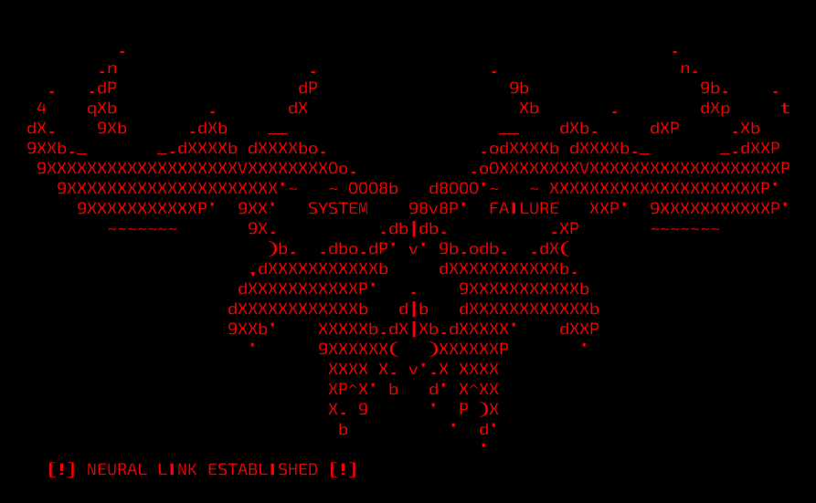

  
  
  <h3>🛡️ Autonomous Adversary Emulation & Cognitive Architecture</h3>

  

    
    
    
  

   

  

   
   

  

    
  

---

> ⚠️ **LEGAL DISCLAIMER & AUTHORIZED USE ONLY** ⚠️
> Este laboratório e todo o ecossistema GHOST (KADMON, AEGIS, OBSIDIAN) são desenvolvidos **estritamente para Pesquisa de Segurança Cibernética Avançada, Emulação Autorizada de Adversários (Red Team) e Fins Educacionais**. Todo o material conceitual visa a defesa proativa de infraestruturas. O autor não fornece malwares compilados para uso público e não se responsabiliza pelo uso indevido de qualquer teoria ou arquitetura aqui descrita. Operações táticas devem ocorrer exclusivamente em ambientes controlados e com consentimento explícito (Rules of Engagement).

  <h2>📜 A Forja: O Arquiteto por Trás da Tríade</h2>

Não sou um desenvolvedor de software tradicional. Meu trabalho não é criar aplicações comerciais, mas sim **arquitetar ecossistemas de resiliência para infraestruturas críticas**. Atuando na intersecção entre a segurança ofensiva e a inteligência artificial, meu laboratório projeta motores cognitivos capazes de pensar, adaptar-se e auditar ambientes complexos antes que adversários reais o façam. 

A segurança de vitrine não sustenta um ataque real. Para forjar a verdadeira blindagem, é necessário abandonar a teoria, emular táticas adversárias avançadas e submeter a infraestrutura a testes de estresse implacáveis.

### 🏴‍☠️ Manifesto Operacional: A Doutrina Power Hat
> "Liberdade operacional não é permissão, é obrigação. A Doutrina Power Hat substitui a burocracia ineficiente pela execução tática direta. Revelamos o invisível e transformamos dados brutos em ação letal. Quem se prepara para o mundo real não teme o risco: controla o tabuleiro antes que a ameaça seja compilada."

---

  <h2>⚙️ O Arsenal: Arquitetura de Espectro Total</h2>

### 1. KADMON & GHOST Protocol
**[ Cognitive C2 Framework & Fileless Mutating Malware ]**

  
  
  
  
  
  
  
  
  
  
  
  
  
  
  
  
  
  
  
  

  
  

O núcleo ofensivo da operação. O KADMON não é um simples payload, é uma quimera em mutação constante. Operando de forma *fileless*, ele injeta código bruto diretamente na memória de processos legítimos, evadindo EDRs. O ecossistema GHOST orquestra essa anomalia, funcionando como uma infraestrutura autônoma de C2 que executa engenharia reversa nas defesas, fornecendo telemetria implacável para Red Teams de elite.

### 2. Projeto AEGIS 
**[ Autonomous Equality & Guard Intelligence System ]**
O tribunal de dados cego a ideologias. O AEGIS é o nosso escudo de auditoria civil, fundamentado no *Privacy by Design*. Utilizando a inteligência de grafos através do **Neo4j**, o sistema correlaciona metadados ocultos para expor redes de corrupção, fraudes, obliterar o feminicídio e desmantelar falsas acusações. Integrado ao KADMON, ele intercepta falhas estruturais operando com precisão matemática pura.

  
  
  

### 3. OBSIDIAN Core (O Cérebro da Operação)
**[ Cognitive Knowledge Mapping & Intelligence Synthesis ]**
O Obsidian não é um bloco de notas corporativo; é o motor de orquestração cognitiva da Tríade. É aqui que os metadados do AEGIS e a telemetria do KADMON são fundidos. Através de uma malha neural de anotações e *graph intelligence*, o Obsidian age como o segundo cérebro do sistema, armazenando arquiteturas de ciberguerra, dissecando ameaças e guiando os próximos ataques operacionais.

---

  <h2>🧠 Combate ao Analfabetismo Digital e Fator Humano</h2>

A infraestrutura mais avançada do mundo desmorona se o fator humano for comprometido. Por isso, lidero ativamente iniciativas focadas na dissecação de ataques de *phishing* e na arquitetura de ferramentas de engenharia social. O objetivo não é apenas testar o código, mas blindar a mente humana contra vetores de manipulação psicológica, cravando a primeira linha de defesa ativa.

---

### 🔭 Mission Statement

I specialize in architecting **Cognitive Command & Control (C2) Frameworks**, mutating memory-injected payloads (KADMON), and conducting **Autonomous Adversary Emulation**. My work obliterates the gap between theoretical compliance and the brutal operational reality of enterprise security. 

* 🛰️ **Offensive Engine:** [KADMON / GHOST Protocol](https://github.com/hackimghost/Kadmon) — Mutating Chimera & Enterprise Resilience Validation.
* 🛡️ **Civil Defense AI:** [Project AEGIS](https://github.com/hackimghost/Project-AEGIS) — Neo4j Graph Intelligence & OSINT Framework.
* 🧠 **Cognitive Core:** [Obsidian] — Operational Brain & Tactical Knowledge Graph.
* 📫 **Contact:** *Restricted to authorized operational channels.*

---

  <h3>"Segurança não é sobre a ausência de vulnerabilidades, mas sobre a capacidade de gerenciar o risco sob ataque total."</h3>
  
   
  

