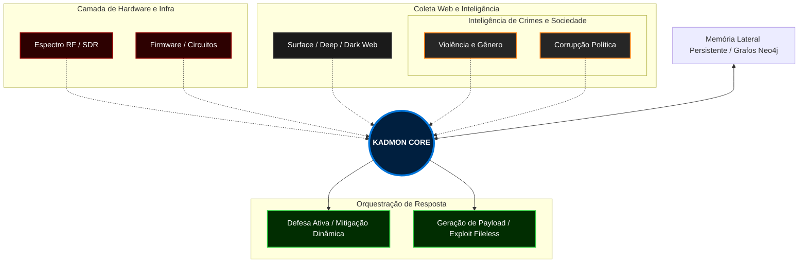
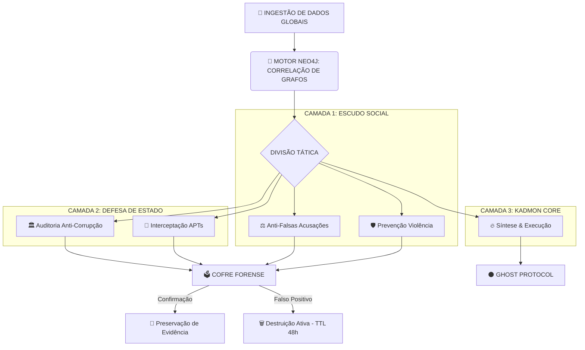

<div align="center">
  
  
  <h3>🛡️ Autonomous Adversary Emulation & Cognitive Architecture</h3>

  <p>
    <a href="https://github.com/hackimghost">
      
    </a>
    <a href="https://kali.org">
      
    </a>
    <a href="https://google.com">
      
    </a>
  </p>

  <br>

  

  <br>
  <br>

  <!-- PROFILE VIEWS + FOLLOWERS BADGES -->
  <p>
    
    
    <a href="https: target="_blank">
      
    </a>
  </p>
  
  <br>

  <!-- TYPING ANIMATION -->
  [](https://git.io/typing-svg)

</div>

<div align="center">
  
</div>

> ⚠️ **LEGAL DISCLAIMER & AUTHORIZED USE ONLY** ⚠️
> Este laboratório e todo o ecossistema (GHOST-PROTOCOL, PHANTOM, KAGE, OBSIDIAN) são desenvolvidos **estritamente para Pesquisa de Segurança Cibernética Avançada, Emulação Autorizada de Adversários (Red Team) e Fins Educacionais**. Todo o material conceitual visa a defesa proativa de infraestruturas. O autor não fornece malwares compilados para uso público e não se responsabiliza pelo uso indevido de qualquer teoria ou arquitetura aqui descrita. Operações táticas devem ocorrer exclusivamente em ambientes controlados e com consentimento explícito (Rules of Engagement).

<div align="center">
  
</div>

##  📜 A Forja: O Arquiteto por Trás da Tríade

<div align="left">

```yaml
name        : Ghost 
location    : 🌍 The Shadows
role        : [ Security Architect, Red Team Operator, AI Dev ]
interests   : [ Autonomous Emulation, Cognitive C2, OSINT, Graph Intelligence ]
status      : Forjando a verdadeira blindagem ⚔️
```

</div>

Não sou um desenvolvedor de software tradicional. Meu trabalho não é criar aplicações comerciais, mas sim **arquitetar ecossistemas de resiliência para infraestruturas críticas**. Atuando na intersecção entre a segurança ofensiva e a inteligência artificial, meu laboratório projeta motores cognitivos capazes de pensar, adaptar-se e auditar ambientes complexos antes que adversários reais o façam.

A segurança de vitrine não sustenta um ataque real. Para forjar a verdadeira blindagem, é necessário abandonar a teoria, emular táticas adversárias avançadas e submeter a infraestrutura a testes de estresse implacáveis.

> ### 🏴‍☠️ Manifesto Operacional: A Doutrina Power Hat
> "Liberdade operacional não é permissão, é obrigação. A Doutrina Power Hat substitui a burocracia ineficiente pela execução tática direta. Revelamos o invisível e transformamos dados brutos em ação letal. Quem se prepara para o mundo real não teme o risco: controla o tabuleiro antes que a ameaça seja compilada."
> 

<div align="center">

</div>

## 🕸️ Arquitetura e Topologia de Dados: Ecossistema Phantom
Este documento descreve a topologia de dados em grafos e o fluxo de orquestração do nosso framework de segurança, evidenciando a interoperabilidade tática entre o **Phantom Kadmon**, o **Ghost Protocol**, e o sistema de inteligência **AEGIS**.

### 1. Visão Geral da Arquitetura (High-Level Design)
A espinha dorsal do sistema opera em um modelo de orquestração autônoma e Comando e Controle (C2) Cognitivo. O fluxo de informações rejeita tabelas relacionais planas em favor de grafos topológicos hospedados em nuvem.

### 2. Orquestração de Dados e Integração com Neo4j
O diferencial arquitetural é a ingestão de dados vetoriais. Cada varredura, detecção de serviço ou extração de payload gera nós (Nodes) e relacionamentos (Relationships) no banco de grafos.

**Exemplo de Mapeamento de Inteligência (Cypher):**
```cypher
MATCH (t:Target {ip: '10.0.0.54', os: 'Linux'})
MERGE (s:Service {name: 'SSH', port: 22})
MERGE (t)-[:EXPOSED_TO]->(s)
MERGE (v:Vulnerability {cve: 'CVE-202X-XXXX'})
MERGE (s)-[:EXPLOITABLE_BY]->(v)
```

<div align="center">

</div>

##  ⚙️ O Arsenal: Arquitetura de Espectro Total

<div align="center">

| 🧩 | Camada de Arquitetura | Stack Tecnológica Visual |
|---|---|---|
| 💀 | **Core Execution & Memory** |  |
| 🧠 | **Cognitive Engine & API** |  |
| 📜 | **Scripting & Automation** |  |
| ⚙️ | **Database & Infra** |  |

</div>

### 1. PHANTOM & GHOST PROTOCOL
**[ Cognitive C2 Framework & Fileless Mutating Malware ]**

> **Core Execution & Memory Logic:**
> 
> **Cognitive Engine & Orchestration:**
> 
> **Scripting & Automation:**
> 
> **Low-Level Hardware & ICS:**
> 

O núcleo ofensivo da operação. O PHANTOM não é um simples payload, é uma quimera em mutação constante. Operando de forma *fileless*, ele injeta código bruto diretamente na memória de processos legítimos, evadindo EDRs. O ecossistema GHOST orquestra essa anomalia, funcionando como uma infraestrutura autônoma de C2 que executa engenharia reversa nas defesas, fornecendo telemetria implacável para Red Teams de elite.

 * **Furtividade e Roteamento Overlay:** A comunicação ocorre através de redes estritamente criptografadas. A gestão de sessões assíncronas adapta sua latência dinamicamente para evadir a detecção de anomalias de SOCs.
 * **GhostMutator:** Motor de mutação heurística que testa a robustez do EDR encapsulando estruturas dinâmicas em memória, operando de forma 100% *fileless*.
 * **Omnicamada e Domínio Físico:** Expansão tática que vai desde mapeamento *Cloud-Native (K8s)* até invasão física (espectro RF/SDR) e domínio profundo de kernels mobile (Android/Apple).

<details>
<summary><b>👁️ Ver Topologia Omnicamada (Phantom Kadmon Core)</b></summary>


```mermaid
graph TD
    classDef internet fill:#1a1a1a,stroke:#333,stroke-width:2px,color:#fff;
    classDef hardware fill:#2d0101,stroke:#8b0000,stroke-width:2px,color:#fff;
    classDef core fill:#001f3f,stroke:#0074D9,stroke-width:4px,color:#fff,font-weight:bold;
    classDef osint fill:#262626,stroke:#ff851b,stroke-width:2px,color:#fff;
    classDef action fill:#012d01,stroke:#2ECC40,stroke-width:2px,color:#fff;

    subgraph Hardware_Infraestrutura [Camada de Hardware e Infra]
        RF[Espectro RF / SDR]:::hardware
        FW[Firmware / Circuitos]:::hardware
    end

    subgraph Coleta_Omnicamada [Coleta Web e Inteligência]
        SW[Surface / Deep / Dark Web]:::internet
        subgraph OSINT_Comportamental [Inteligência de Crimes e Sociedade]
            VIOL[Violência e Gênero]:::osint
            CORR[Corrupção Política]:::osint
        end
    end

    KCore((KADMON CORE)):::core
    MemL[Memória Lateral Persistente / Grafos Neo4j]

    RF & FW & SW & VIOL & CORR -.-> KCore
    MemL <--> KCore

    subgraph Resposta_Soberana [Orquestração de Resposta]
        DYN[Defesa Ativa / Mitigação Dinâmica]:::action
        PAY[Geração de Payload / Exploit Fileless]:::action
    end

    KCore --> DYN & PAY
```

</details>

### 2. Projeto KAGE
**[ Autonomous Equality & Guard Intelligence System ]**

> **Architecture Stack:**
> 
> 

O tribunal de dados cego a ideologias. O KAGE é o nosso escudo de auditoria civil, fundamentado no *Privacy by Design*. Utilizando a inteligência de grafos através do **Neo4j**, o sistema correlaciona metadados ocultos para expor redes de corrupção, fraudes. Integrado ao PHANTOM, ele intercepta falhas estruturais operando com precisão matemática pura.

 1. **Escudo Civil:** Prevenção de violência, rastreio de radicalização e protocolo forense anti-calúnia.
 2. **Radar Soberano:** Blindagem de infraestrutura crítica e auditoria anti-corrupção (Deteção de APTs de Estado).
 3. **Core Oculto:** Processamento lateral fora do alcance de censura política.

**LGPD e Destruição Ativa:** O KAGE opera sob conformidade estrita. Qualquer coleta roda com um TTL (Time To Live) de 48 horas. Se não houver confirmação de evento crítico (Falso Positivo), os logs sofrem destruição algorítmica.

<details>
<summary><b>🛡️ Ver Arquitetura de Defesa (AEGIS Flow)</b></summary>


```mermaid
graph TD
    A["📡 INGESTÃO DE DADOS GLOBAIS"] --> B("🧠 MOTOR NEO4J: CORRELAÇÃO DE GRAFOS")
    B --> C{"DIVISÃO TÁTICA"}
    
    subgraph "CAMADA 1: ESCUDO SOCIAL"
    C --> C1["🛡️ Prevenção Violência"]
    C --> C2["⚖️ Anti-Falsas Acusações"]
    end
    
    subgraph "CAMADA 2: DEFESA DE ESTADO"
    C --> D1["📡 Interceptação APTs"]
    C --> D2["🏛️ Auditoria Anti-Corrupção"]
    end
    
    subgraph "CAMADA 3: KADMON CORE"
    C --> E1["🔥 Síntese & Execução"]
    end
    
    C1 & C2 & D1 & D2 --> F["🗳️ COFRE FORENSE"]
    F -->|"Confirmação"| F1["📂 Preservação de Evidência"]
    F -->|"Falso Positivo"| F2["🗑️ Destruição Ativa - TTL 48h"]
    E1 --> G["🌑 GHOST PROTOCOL"]
```

</details>

### 3. OBSIDIAN Core (O Cérebro da Operação)
**[ Cognitive Knowledge Mapping & Intelligence Synthesis ]**
O Obsidian não é um bloco de notas corporativo; é o motor de orquestração cognitiva da Tríade. É aqui que os metadados do AEGIS e a telemetria do KADMON são fundidos. Através de uma malha neural de anotações e *graph intelligence*, o Obsidian age como o segundo cérebro do sistema, armazenando arquiteturas de ciberguerra, dissecando ameaças e guiando os próximos ataques operacionais.

<div align="center">

</div>

##  🧠 Combate ao Analfabetismo Digital e Fator Humano
A infraestrutura mais avançada do mundo desmorona se o fator humano for comprometido. Por isso, lidero ativamente iniciativas focadas na dissecação de ataques de *phishing* e na arquitetura de ferramentas de engenharia social. O objetivo não é apenas testar o código, mas blindar a mente humana contra vetores de manipulação psicológica, cravando a primeira linha de defesa ativa.

<div align="center">

</div>

##  🔭 Mission Statement
I specialize in architecting **Cognitive Command & Control (C2) Frameworks**, mutating memory-injected payloads (PHANTOM), and conducting **Autonomous Adversary Emulation**. My work obliterates the gap between theoretical compliance and the brutal operational reality of enterprise security.
 * 🛰️ **Offensive Engine:** PHANTOM / GHOST PROTOCOL — Mutating Chimera & Enterprise Resilience Validation.
 * 🛡️ **Civil Defense AI:** Project KAGE AEGIS — Neo4j Graph Intelligence & OSINT Framework.
 * 🧠 **Cognitive Core:** [Obsidian] — Operational Brain & Tactical Knowledge Graph.
 * 📫 **Contact:** *Restricted to authorized operational channels.*

<div align="center">

</div>

##  Contributions (Pac-Man)
<div align="center">
<picture>
<source media="(prefers-color-scheme: dark)" srcset="https://raw.githubusercontent.com/hackimghost/hackimghost/output-pacman/pacman-contribution-graph-dark.svg">
<source media="(prefers-color-scheme: light)" srcset="https://raw.githubusercontent.com/hackimghost/hackimghost/output-pacman/pacman-contribution-graph.svg">

</picture>
</div>

<div align="center">

</div>

##  📊 Telemetria e Estatísticas
<div align="center">
<h3>"Segurança não é sobre a ausência de vulnerabilidades, mas sobre a capacidade de gerenciar o risco sob ataque total."</h3>


<br>
Activity Graph
</div>

<div align="center">
<!-- FOOTER WAVE -->

</div>
